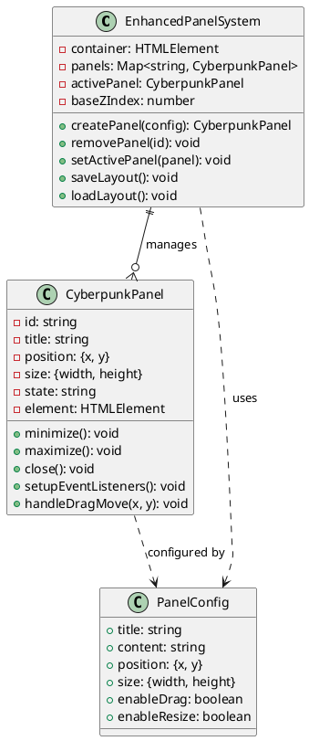
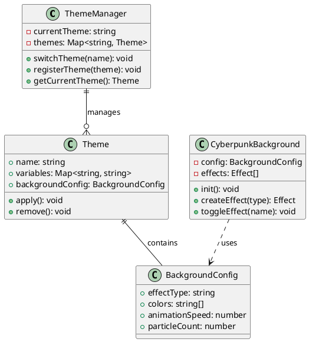
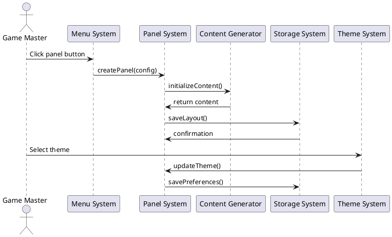
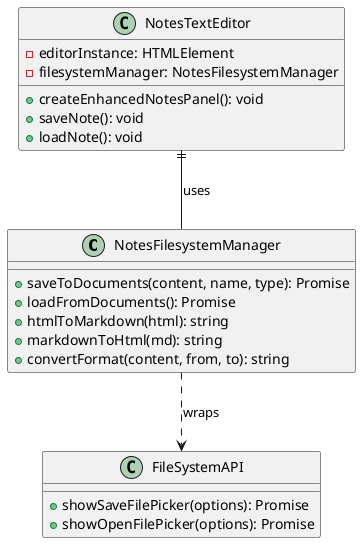

# Cyberpunk GM Screen - Web Administration Guide

## Table of Contents
1. [Project Overview](#project-overview)
2. [System Architecture](#system-architecture)
3. [UML Diagrams](#uml-diagrams)
4. [Panel System Documentation](#panel-system-documentation)
5. [Technical Code Layout](#technical-code-layout)
6. [Theme and Style Architecture](#theme-and-style-architecture)
7. [File Structure and Organization](#file-structure-and-organization)
8. [Configuration Management](#configuration-management)
9. [Future Enhancements](#future-enhancements)
10. [Troubleshooting and Maintenance](#troubleshooting-and-maintenance)

---

## Project Overview

### Purpose
The Cyberpunk GM Screen is a comprehensive web-based application designed to assist Game Masters running Cyberpunk Red RPG sessions. It provides a modular, panel-based interface with essential tools, references, and generators for managing gameplay.

### Core Features
- **Modular Panel System**: Draggable, resizable panels for different tools
- **Comprehensive Rules Reference**: Complete Cyberpunk Red mechanics
- **Interactive Tools**: Dice rollers, combat trackers, netrunning interfaces
- **Content Generators**: Random tables, NPCs, encounters, plot hooks
- **Session Management**: Notes, timelines, campaign tracking
- **User Profiles**: Save/load preferences and layouts
- **Filesystem Integration**: Save/load notes to local filesystem

### Technology Stack
- **Frontend**: HTML5, CSS3, JavaScript (ES6+)
- **Architecture**: Component-based modular design
- **Storage**: LocalStorage, File System Access API
- **Audio**: Web Audio API for sound effects
- **Graphics**: Canvas API for backgrounds and maps
- **PWA**: Service Worker for offline functionality

---

## System Architecture

### High-Level Architecture

```
┌─────────────────────────────────────────────────────────────┐
│                    Cyberpunk GM Screen                      │
├─────────────────────────────────────────────────────────────┤
│  User Interface Layer                                       │
│  ┌─────────────┬─────────────┬─────────────┬─────────────┐  │
│  │   Header    │  Side Menu  │   Panels    │  Background │  │
│  │   System    │    Tray     │   System    │   Effects   │  │
│  └─────────────┴─────────────┴─────────────┴─────────────┘  │
├─────────────────────────────────────────────────────────────┤
│  Core Systems Layer                                         │
│  ┌─────────────┬─────────────┬─────────────┬─────────────┐  │
│  │   Panel     │   Theme     │   Sound     │  Storage    │  │
│  │  Manager    │  Manager    │  System     │  Manager    │  │
│  └─────────────┴─────────────┴─────────────┴─────────────┘  │
├─────────────────────────────────────────────────────────────┤
│  Data Layer                                                 │
│  ┌─────────────┬─────────────┬─────────────┬─────────────┐  │
│  │ LocalStorage│ File System │ User Prefs  │ Game Data   │  │
│  │    API      │ Access API  │   Storage   │  Generators │  │
│  └─────────────┴─────────────┴─────────────┴─────────────┘  │
└─────────────────────────────────────────────────────────────┘
```

### Component Interaction Model

```
User Action → Menu System → Panel Creation → Content Generation → Storage
     ↑                                              ↓
Theme Management ← Background Effects ← Audio System ← Event Handlers
```

---

## UML Diagrams

### 1. Panel System Class Diagram



### 2. Theme System Architecture



### 3. Data Flow Diagram



### 4. File System Integration



---

## Panel System Documentation

### Core Panels

#### 1. Dice & Basic Tools
- **DICE.SYS v2.1**: Advanced dice roller with critical hit detection, modifiers, and roll history
- **Enhanced Rules Reference**: Searchable Cyberpunk Red rules database
- **Quick Rules Reference**: Essential game mechanics summary
- **Netrunning Rules**: Comprehensive netrunning system reference

#### 2. Combat & Encounters
- **Combat Tracker**: Initiative tracking, health management, status effects
- **Encounter Generator**: Random encounter creation with detailed scenarios
- **Initiative Tracker**: Turn order management with customizable rounds
- **Status Effects**: Track conditions, duration, and effects on characters
- **Netrunning Interface**: Interactive terminal for netrunning encounters

#### 3. World Building
- **NPC Generator**: Create detailed NPCs with stats, motivations, and backgrounds
- **Location Generator**: Generate Night City locations with descriptions
- **Night City Map**: Interactive district map with locations and encounters
- **Lore Browser**: Searchable database of Cyberpunk lore and information
- **Corporation Generator**: Create detailed corporations with leadership and activities
- **Gang Generator**: Generate street gangs with territories and activities

#### 4. Campaign Management
- **Session Notes**: Rich text editor with filesystem save/load support
- **Campaign Tracker**: Track ongoing storylines, NPCs, and plot threads
- **Timeline Tracker**: Chronicle campaign events and character development
- **Reputation Tracker**: Monitor character standing with factions

#### 5. AI Assistance
- **Random Tables**: Comprehensive generators for names, locations, encounters, loot
- **Plot Hook Generator**: Create engaging adventure hooks with complications
- **AI Assistant Panel**: Placeholder for future AI integration

#### 6. Settings & Utilities
- **Settings & Utilities**: Configure audio, themes, and system preferences
- **User Profile Manager**: Save/load user preferences and panel layouts
- **Performance Monitor**: System performance tracking and optimization

### Panel Features
- **Draggable**: Move panels anywhere on screen
- **Resizable**: Adjust panel size with corner handles
- **Minimizable**: Collapse panels to taskbar
- **Maximizable**: Full-screen mode for focused work
- **Closeable**: Remove panels when not needed
- **Persistent**: Panel positions and content saved automatically

---

## Technical Code Layout

### Directory Structure
```
cyberpunk-gm-screen/
├── src/
│   ├── css/                    # Stylesheets
│   │   ├── styles.css         # Main styles
│   │   ├── themes.css         # Theme definitions
│   │   └── enhanced-panels-fixed.css # Panel system styles
│   ├── js/                     # JavaScript modules
│   │   ├── enhanced-panel-system-fixed.js # Core panel system
│   │   ├── notes-text-editor.js # Rich text editor
│   │   ├── notes-filesystem-manager.js # File system integration
│   │   ├── night-city-map.js  # Interactive map
│   │   ├── user-profile-manager.js # User preferences
│   │   └── [other modules]
│   ├── fonts/                  # Custom fonts
│   ├── images/                # Icons and graphics
│   └── styles/                # Additional style modules
├── docs/                      # Documentation
├── scripts/                   # Build and deployment scripts
├── cyberpunk-gm-screen.html  # Main application file
├── manifest.json             # PWA manifest
└── service-worker.js         # Service worker for offline support
```

### Core JavaScript Architecture

#### 1. Panel System (`enhanced-panel-system-fixed.js`)
```javascript
class EnhancedPanelSystem {
  constructor(options) {
    this.container = options.container;
    this.panels = new Map();
    this.activePanel = null;
    this.baseZIndex = 1000;
  }
  
  createPanel(config) {
    const panel = new CyberpunkPanel(config);
    this.panels.set(panel.id, panel);
    return panel;
  }
}

class CyberpunkPanel {
  constructor(options) {
    this.id = options.id || `panel-${Date.now()}`;
    this.title = options.title;
    this.position = options.position || { x: 320, y: 50 };
    this.size = options.size || { width: 400, height: 300 };
  }
}
```

#### 2. Theme Management
```javascript
// Theme switching logic
function switchTheme(themeName) {
  document.body.setAttribute('data-theme', themeName);
  if (window.themeManager) {
    window.themeManager.setTheme(themeName);
  }
}

// Theme definitions in CSS
[data-theme="neon-synthwave"] {
  --primary: #00ccff;
  --secondary: #ff00aa;
  --bg-primary: #0a0a15;
}
```

#### 3. Storage System
```javascript
// Layout persistence
saveLayout() {
  const layout = {
    panels: Array.from(this.panels.values()).map(panel => ({
      id: panel.id,
      position: panel.position,
      size: panel.size,
      state: panel.state
    }))
  };
  localStorage.setItem('panelLayout', JSON.stringify(layout));
}
```

### Event System
- **Global Event Bus**: Centralized event management
- **Panel Events**: Drag, resize, minimize, maximize, close
- **Theme Events**: Theme switching, preference updates
- **Storage Events**: Save/load operations
- **User Interaction**: Click, keyboard shortcuts, touch gestures

---

## Theme and Style Architecture

### CSS Architecture
The styling system uses a modular approach with CSS custom properties for theming:

#### 1. Base Variables (`cyberpunk-variables.css`)
```css
:root {
  /* Base colors */
  --primary: #00ccff;
  --secondary: #ff00aa;
  --success: #00ff41;
  --warning: #ffaa00;
  --danger: #ff0040;
  
  /* Background */
  --bg-primary: #0a0a15;
  --bg-surface: rgba(20, 20, 35, 0.9);
  --bg-overlay: rgba(0, 0, 0, 0.8);
  
  /* Text */
  --text-primary: #e0e0e0;
  --text-secondary: #b0b0b0;
  --text-muted: #808080;
  
  /* Borders */
  --border-color: #333;
  --border-width: 1px;
  --border-radius: 4px;
  
  /* Fonts */
  --font-primary: 'Orbitron', monospace;
  --font-secondary: 'Share Tech Mono', monospace;
}
```

#### 2. Theme Variants (`themes.css`)
```css
/* Neon Synthwave Theme */
[data-theme="neon-synthwave"] {
  --primary: #00ccff;
  --secondary: #ff00aa;
  --bg-primary: #0a0a15;
}

/* Tech Noir Theme */
[data-theme="tech-noir"] {
  --primary: #ffffff;
  --secondary: #cccccc;
  --bg-primary: #000000;
}

/* Netrunner Theme */
[data-theme="netrunner"] {
  --primary: #00ff41;
  --secondary: #41ff00;
  --bg-primary: #001100;
}
```

#### 3. Component Styles
```css
/* Panel System */
.panel {
  background: var(--bg-surface);
  border: var(--border-width) solid var(--border-color);
  border-radius: var(--border-radius);
  backdrop-filter: blur(10px);
}

.panel-header {
  background: linear-gradient(135deg, var(--primary), var(--secondary));
  color: var(--text-primary);
  padding: 10px 15px;
}

/* Interactive Elements */
.cyber-button {
  background: var(--bg-surface);
  border: 1px solid var(--primary);
  color: var(--primary);
  transition: all 0.3s ease;
}

.cyber-button:hover {
  background: var(--primary);
  color: var(--bg-primary);
  box-shadow: 0 0 20px var(--primary);
}
```

### Responsive Design
```css
/* Desktop */
@media (min-width: 1024px) {
  .side-tray { width: 300px; }
  .panel { min-width: 300px; }
}

/* Tablet */
@media (min-width: 768px) and (max-width: 1023px) {
  .side-tray { width: 250px; }
  .panel { min-width: 250px; }
}

/* Mobile */
@media (max-width: 767px) {
  .side-tray { width: 100%; }
  .panel { 
    width: 100% !important;
    height: 100% !important;
  }
}
```

---

## File Structure and Organization

### Primary Files

#### `cyberpunk-gm-screen.html`
- **Purpose**: Main application entry point
- **Contains**: HTML structure, inline styles, panel creation functions
- **Size**: ~4800+ lines (comprehensive)
- **Key Sections**:
  - Head: Meta tags, stylesheets, fonts
  - Body: Header, menu tray, panel container
  - Scripts: Panel creation functions, initialization

#### Core JavaScript Modules

| File | Purpose | Key Classes/Functions |
|------|---------|----------------------|
| `enhanced-panel-system-fixed.js` | Panel management | `EnhancedPanelSystem`, `CyberpunkPanel` |
| `notes-text-editor.js` | Rich text editing | `createEnhancedNotesPanel` |
| `notes-filesystem-manager.js` | File system access | `NotesFilesystemManager` |
| `night-city-map.js` | Interactive map | `NightCityMap` |
| `user-profile-manager.js` | User preferences | Profile save/load functions |
| `theme-manager.js` | Theme switching | `ThemeManager` |
| `sound-manager.js` | Audio system | `SoundManager` |

#### Style Modules

| File | Purpose | Key Features |
|------|---------|--------------|
| `enhanced-panels-fixed.css` | Panel styling | Draggable panels, animations |
| `themes.css` | Theme definitions | Color schemes, variants |
| `cyberpunk-typography.css` | Font styles | Cyberpunk fonts, text effects |
| `design-system.css` | Base components | Buttons, inputs, layouts |

### Configuration Files

#### `manifest.json`
```json
{
  "name": "Cyberpunk GM Screen",
  "short_name": "CP GM Screen",
  "description": "Comprehensive GM tools for Cyberpunk Red",
  "start_url": "./cyberpunk-gm-screen.html",
  "display": "standalone",
  "theme_color": "#00ccff",
  "background_color": "#0a0a15",
  "icons": [
    {
      "src": "src/images/icon-192x192.png",
      "sizes": "192x192",
      "type": "image/png"
    }
  ]
}
```

#### `service-worker.js`
- **Purpose**: Offline functionality, caching
- **Features**: Cache static assets, background sync
- **Storage**: Caches HTML, CSS, JS, images

---

## Configuration Management

### User Preferences Storage

#### LocalStorage Structure
```javascript
// Panel Layout
{
  "panelLayout": {
    "panels": [
      {
        "id": "notes-123456",
        "position": { "x": 320, "y": 100 },
        "size": { "width": 500, "height": 400 },
        "state": "normal"
      }
    ]
  }
}

// User Profile
{
  "userProfile": {
    "theme": "neon-synthwave",
    "soundEnabled": true,
    "soundVolume": 0.3,
    "autoSave": true,
    "lastUsed": "2025-01-27T10:30:00Z"
  }
}

// Notes Content
{
  "notesContent": {
    "default-note": "<p>Session notes content...</p>",
    "character-notes": "<h2>Character Development</h2>..."
  }
}
```

### System Settings

#### Audio Configuration
```javascript
const soundSettings = {
  enabled: true,
  volume: 0.3,
  effects: {
    diceRoll: 'sounds/dice-roll.ogg',
    criticalHit: 'sounds/critical-hit.ogg',
    combatHit: 'sounds/combat-hit.ogg'
  }
};
```

#### Theme Configuration
```javascript
const themeConfig = {
  current: 'neon-synthwave',
  available: [
    'neon-synthwave',
    'tech-noir', 
    'netrunner',
    'corporate',
    'street-punk'
  ],
  autoSwitch: false
};
```

---

## Future Enhancements

### Phase 1: Core Improvements

#### 1. Enhanced AI Integration
- **GPT Integration**: Connect to OpenAI API for dynamic content generation
- **Smart NPCs**: AI-generated personalities and dialogue
- **Dynamic Plots**: AI-assisted story development
- **Voice Commands**: Speech-to-text for hands-free operation

#### 2. Multiplayer Support
- **WebRTC Integration**: Real-time collaboration between GM and players
- **Shared Panels**: Live-sync panels between participants
- **Player Dashboards**: Dedicated interfaces for players
- **Chat System**: Integrated text and voice communication

#### 3. Advanced Content Management
- **Campaign Database**: PostgreSQL backend for persistent storage
- **Import/Export**: Support for other GM tools (Roll20, Foundry VTT)
- **Asset Management**: Upload and organize images, documents, audio
- **Version Control**: Track changes to campaign data

### Phase 2: Platform Expansion

#### 1. Mobile Applications
- **React Native App**: Native mobile experience
- **Tablet Optimization**: Enhanced tablet interface
- **Offline Mode**: Full functionality without internet
- **Gesture Controls**: Touch-optimized interactions

#### 2. Desktop Applications
- **Electron Wrapper**: Desktop app with native OS integration
- **Multiple Monitors**: Span panels across multiple displays
- **Native Notifications**: System-level alerts and reminders
- **File System Integration**: Enhanced local file access

#### 3. Browser Extensions
- **Chrome Extension**: Quick access to tools from any page
- **Bookmark Sync**: Synchronize bookmarks across devices
- **Context Menus**: Right-click integration for quick actions

### Phase 3: Advanced Features

#### 1. Virtual Reality Support
- **WebXR Integration**: VR panel management
- **3D Visualization**: Immersive combat tracking
- **Spatial Audio**: 3D positioned sound effects
- **Hand Tracking**: Gesture-based panel manipulation

#### 2. Advanced Analytics
- **Session Analytics**: Track game sessions and player engagement
- **Performance Metrics**: Monitor app performance and usage
- **A/B Testing**: Test new features with user segments
- **Heat Maps**: Analyze panel usage patterns

#### 3. Plugin System
- **API Framework**: Allow third-party developers to create plugins
- **Plugin Store**: Marketplace for community-created tools
- **Custom Panels**: User-created panel types
- **Scripting Support**: JavaScript API for automation

### Phase 4: Enterprise Features

#### 1. Multi-Campaign Management
- **Campaign Switching**: Quick switch between multiple campaigns
- **Player Management**: Centralized player database
- **Schedule Integration**: Calendar integration for session planning
- **Resource Sharing**: Share assets between campaigns

#### 2. Advanced Security
- **User Authentication**: Login system with role-based access
- **Encryption**: End-to-end encryption for sensitive data
- **Backup Systems**: Automated cloud backups
- **Access Logs**: Track user actions and changes

#### 3. Professional Tools
- **Campaign Templates**: Pre-built campaign structures
- **Professional Themes**: High-quality visual themes
- **Export Options**: Professional-quality printouts and PDFs
- **Integration APIs**: Connect with other professional GM tools

---

## Implementation Roadmap

### Q1 2025: Foundation Improvements
- [ ] Bug fixes and performance optimization
- [ ] Enhanced mobile responsiveness
- [ ] Improved accessibility features
- [ ] Better error handling and user feedback

### Q2 2025: AI Integration
- [ ] OpenAI API integration
- [ ] Smart content generation
- [ ] Voice command support
- [ ] Enhanced random generators

### Q3 2025: Multiplayer Features
- [ ] WebRTC implementation
- [ ] Real-time collaboration
- [ ] Player interfaces
- [ ] Shared session management

### Q4 2025: Platform Expansion
- [ ] Mobile app development
- [ ] Desktop application
- [ ] Browser extension
- [ ] Cross-platform synchronization

### 2026: Advanced Features
- [ ] VR/AR support
- [ ] Advanced analytics
- [ ] Plugin ecosystem
- [ ] Enterprise features

---

## Troubleshooting and Maintenance

### Common Issues

#### 1. Panel System Issues
**Problem**: Panels not creating or appearing incorrectly
**Solutions**:
- Check console for JavaScript errors
- Verify `window.panelSystem` is initialized
- Clear localStorage and refresh
- Check for CSS conflicts

#### 2. Theme Problems
**Problem**: Themes not switching or displaying incorrectly
**Solutions**:
- Verify theme CSS files are loaded
- Check `data-theme` attribute on body element
- Clear browser cache
- Validate CSS custom properties

#### 3. Storage Issues
**Problem**: Settings or layouts not persisting
**Solutions**:
- Check localStorage availability
- Verify JSON format validity
- Clear corrupted localStorage entries
- Check browser storage limits

#### 4. Performance Issues
**Problem**: Slow rendering or high memory usage
**Solutions**:
- Enable performance monitoring
- Reduce active panels
- Check for memory leaks
- Optimize background effects

### Maintenance Tasks

#### Daily
- [ ] Monitor error logs
- [ ] Check user feedback
- [ ] Verify core functionality

#### Weekly
- [ ] Review performance metrics
- [ ] Update content and generators
- [ ] Test new features
- [ ] Backup user data

#### Monthly
- [ ] Security audit
- [ ] Update dependencies
- [ ] Performance optimization
- [ ] Feature planning review

#### Quarterly
- [ ] Major version planning
- [ ] User survey analysis
- [ ] Infrastructure review
- [ ] Roadmap updates

---

## Deployment and Operations

### Development Environment
```bash
# Local development server
python3 -m http.server 8080

# Or use Node.js
npx http-server -p 8080

# Access at http://localhost:8080
```

### Production Deployment
```bash
# GitHub Pages deployment
git add .
git commit -m "Deploy updates"
git push origin main

# Manual deployment
rsync -av --delete ./dist/ user@server:/var/www/cyberpunk-gm/
```

### Monitoring
- **Error Tracking**: JavaScript error monitoring
- **Performance**: Core Web Vitals tracking
- **Usage Analytics**: User interaction tracking
- **Uptime Monitoring**: Service availability checks

### Backup Strategy
- **Code**: Git repository with multiple remotes
- **User Data**: LocalStorage export functionality
- **Assets**: CDN with versioning
- **Database**: Regular SQL dumps (future feature)

---

## Security Considerations

### Current Security Measures
- **CSP Headers**: Content Security Policy implementation
- **Input Validation**: Sanitize user inputs
- **File Access**: Secure File System Access API usage
- **No External Dependencies**: Minimize third-party risks

### Future Security Enhancements
- **Authentication**: User login system
- **Encryption**: End-to-end encryption for sensitive data
- **Audit Logs**: Track user actions and changes
- **Rate Limiting**: Prevent abuse of APIs

---

## Contributing Guidelines

### Code Standards
- **ES6+**: Modern JavaScript features
- **CSS Custom Properties**: For theming
- **Modular Architecture**: Separate concerns
- **Documentation**: Comprehensive inline comments

### Testing Requirements
- **Browser Testing**: Chrome, Firefox, Safari, Edge
- **Device Testing**: Desktop, tablet, mobile
- **Accessibility Testing**: Screen readers, keyboard navigation
- **Performance Testing**: Load times, memory usage

### Review Process
1. **Feature Planning**: Document requirements
2. **Implementation**: Follow coding standards
3. **Testing**: Comprehensive testing across browsers
4. **Documentation**: Update admin guide and user docs
5. **Deployment**: Staged rollout with monitoring

---

This administration guide provides a comprehensive overview of the Cyberpunk GM Screen project, covering all technical aspects, architecture decisions, and future development plans. It serves as both a reference for current maintenance and a roadmap for future enhancements.